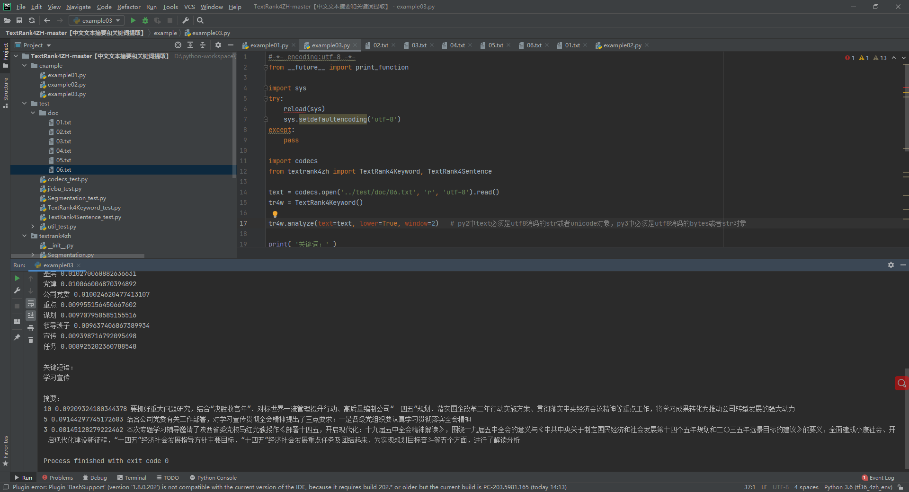

# TextRank4ZH-master
中文文本摘要和关键词提取

(base) C:\Users\DELL>conda activate tf36_4zh_env

(tf36_4zh_env) C:\Users\DELL>pip list
Package          Version
---------------- -------------------
certifi          2020.12.5
decorator        4.4.2
jieba            0.42.1
networkx         2.5
numpy            1.19.4
object-detection 0.1
pip              20.3.3
setuptools       51.0.0.post20201207
textrank4zh      0.3
wheel            0.36.2
wincertstore     0.2

(tf36_4zh_env) C:\Users\DELL>python
Python 3.6.12 |Anaconda, Inc.| (default, Sep  9 2020, 00:29:25) [MSC v.1916 64 bit (AMD64)] on win32
Type "help", "copyright", "credits" or "license" for more information.
>>>

=======================================================================================================

